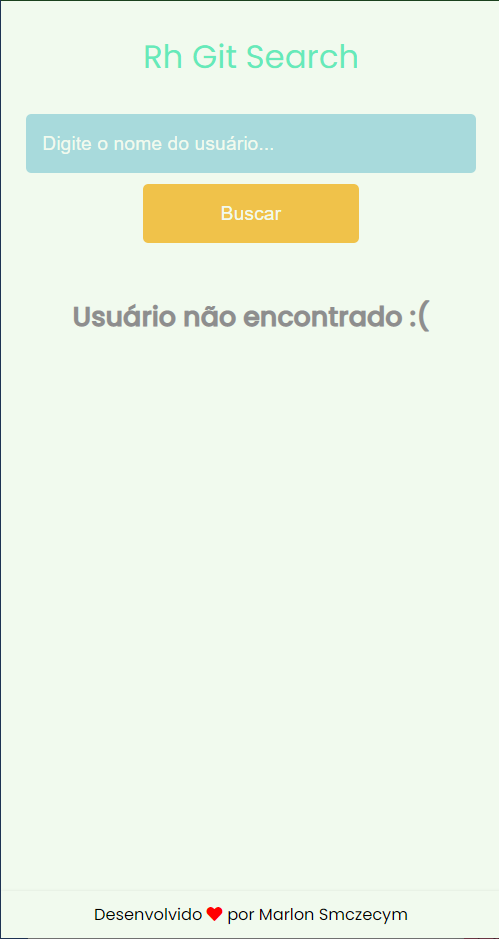

# RH Git Search

O layout produzido foi feito por mim mesmo Marlon Symczecym, e a parte da programação também.

O desafio foi me fornecido para resolver um problema de uma pessoa do RH, onde recebia de seus candidatos seus nomes no gitHub, e gostaria de uma forma de pesquisar pelo seu nome e encontrar detalhes seu e seus respositório, sem necessitar ir até o gitHub.

Sendo assim foi desenvolvido um layout intuitivo, e simplificado, para que fosse apresentado de forma concisa, elegante e de fácil compreensão por pessoas que não tem conhecimentos de uma plataforma como gitHub.
Para as telas foi utilizado a fonte Poppins, por ser uma fonte sem serifa, assim combinando com o layout com formas mais arredondadas.

A paleta de cores foi escolhida para ser suave, escolhendo cores mais pasteis, e utilizando o estilo do skeumorfismo para definição dos repositórios, para levar ao usuário algo mais próximo ao elemento real, como se fosse realmente um botão.

As informações que foram priorizadas para o usuário foram:

- Nome completo
- Localização
- Repositórios públicos

ão foi pego as demais informações, por muitas vezes nem os próprios usuários colocarem, assim muitas vezes nem aparecendo mesmo.
Já essas informações, estão contidas em mais grande certeza.

E as informações para a apresentação dos repositórios foram:

- Nome do repositório
- Linguagem
- Stars
- Watchers
- Forks

Essas informações, muitas vezes são as que mais interessam ao usuário, pois dá para ter uma boa visão do usuário, de como foi mantido o seu repositório e qual foi a repercusão dele.

## Ferramentas

No projeto foi utilizado:

- CSS3
- HTML5
- ReactJs
- JSX
- TypeScript
- Redux / Redux Saga
- Hooks
- GitHub
- Styled Components
- Mobile First

## Especificidades

Logo abaixo será mostrada imagens de como ficaram as telas, tanto no formato Desktop, quanto no formato mobile, em diferentes situações, como feedbacks que aparece ao não encotrar o usuário na plataforma, e como fica no início sem pesquisar nada.

- ## Tela Inicial - Desktop

Essa é a tela inicial, onde mostra apenas o nome do projeto, o input para informar o nome do usuário dentro do gitHub, e o botão para buscar pelo usuário.

- ## Tela Inicial - Mobile

  Na mesma tela da de cima, só que na versão mobile, foi pensado na questão acessibilidade do usuário, assim fazendo o input ocupar maior espaço em icma, e deixar o botão abaixo, maior, assim fica mais fácil e rápido para se buscar pelo que precisa.

  

- ## Tela de Erro - Desktop

A tela para mostrar o erro, foi feito de maneira simplificada, só avisando, que não foi encontrado o usuário, e permitindo a busca por um outro nome.

- ## Tela de Erro - Mobile

Na tela do mobile, foi seguido a mesma ideia, só aumentando um pouco a tipografia, para ficar mais evidente.

- ## Tela Completa - Desktop

E finalmente a tela completa, é onde aparece todas as informações que se necessita, as informações já ditas lá em cima, mostrando o usuário logo abaixo do input, e mostrando abaixo do usuário todos os repositórios que ele possui em sua conta do gitHub, podendo assim conferir também clicando sobre o repositório para ir direto para a página dele, e ver mais informações.

- ## Tela Completa - Mobile

Na tela final do mobile, foi feito algumas modificações no layout, fazendo a rolagem vertical das informações, a transformando em uma lista vertical, fazendo os repositórios tomarem conta da linha toda, para ficar mais visível, para quem estiver conferindo as informações

## Instruções de Uso

Para testar o projeto em questão, só seguir as seguintes dicas:

**Obs:** Precisa ter o node instalado em sua máquina, para isso pode ir direto no site do [node js](https://nodejs.org/en/) e instalar ele.

- Abrir o projeto em seu editor, se ele tiver um terminal integrado, pode usar ele, mas se não tiver, abra o seu terminal do sistema operacional, o powerShell, e dê o seguinte comando:
  `npm install`. Esse comando irá baixar todos os pacotes necessários para rodar a aplicação.
- Agora com as dependências já adicionada ao projeto, pode iniciar ele com o comando: `npm start`.

## AUTOR

Marlon Symczecym

**Linkedin:** [Marlon Symczecym](https://www.linkedin.com/in/marlonsymczecym/)
